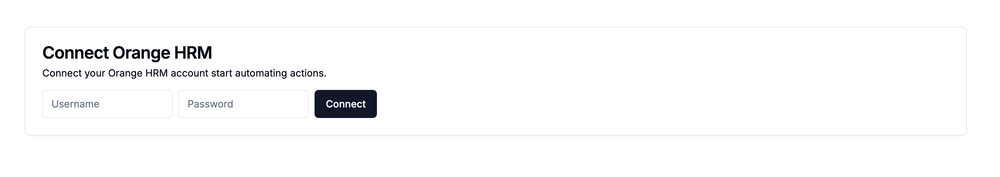

# Orange HRM automation using Intuned credentials-based auth session  

simple project that showcase how to use Intuned credentials-based auth session to collect access to users Orange HRM accounts and automate actions on behalf of them. 

## Getting started

before getting started you need access to intuned platform. [contact us](https://docs.intunedhq.com/docs/support/contact-us) if you do not have access.  

1. follow steps [here](https://github.com/Intuned/intuned-auth-sessions-integration-examples/tree/main?tab=readme-ov-file#installation) to clone the repo and install dependencies.
2. follow the following guide to create your intuned project [How to use Credentials-based auth sessions](https://docs.intunedhq.com/docs/guides/auth/how-to-authenticate-with-credentials).
3. setup your `.env` file with the following environment variables:
    1.  `DATABASE_URL`: project uses postgress to store users and connections. you can use any postgress database. the project includes a `docker-compose.yml` file to start a postgress container.
    2.  `INTUNED_API_KEY`: [How to create API keys?](https://docs.intunedhq.com/docs/guides/platform/how-to-create-api-keys)
    3.  `INTUNED_WORKSPACE_ID`: [How to get a workspace ID?](https://docs.intunedhq.com/docs/guides/platform/how-to-get-a-workspace-id)
    4.  `INTUNED_PROJECT_NAME`: [How to get a project name?](https://docs.intunedhq.com/docs/guides/platform/how-to-get-project-name)
    5.  `AUTH_SECRET`: random string.

4. run the project:
```bash
yarn dev
```


# Details

1. build your custom ui to collect orange hrm credentials and start the auth session creation process.




2. Using Intuned's client sdk to interact with the platform.

> [!NOTE]
> communication with intuned should happen on the server, the project uses react server actions to do that for simplicity, you can replace these actions with apis. 


```ts
import { IntunedClient } from "@intuned/client";

export function getIntunedClient() {
  return new IntunedClient({
    apiKey: process.env.INTUNED_API_KEY as string,
    workspaceId: process.env.INTUNED_WORKSPACE_ID as string,
  });
}
```

2. start the auth session creation operation with user credentials.

```ts
    // start the auth session creation operation with user credentials
    const startResult = await intunedClient.project.authSessions.create.start(
      INTUNED_PROJECT_NAME,
      {
        id,
        parameters: {
          username: formData.get("username")?.toString(),
          password: formData.get("password")?.toString(),
        },
      }
    );

    // get the operation id from the start response
    const operationId = startResult.operationId;

    // wait for the operation to finish
    while (true) {
      const operationResult =
        await intunedClient.project.authSessions.create.result(
          INTUNED_PROJECT_NAME,
          operationId
        );

      // if the operation is done, create the connection between the user and the auth session
      if (operationResult.status === "done") {
        const userId = await getLoggedInUserId();
        const authSessionId = operationResult.authSessionId;
        await createUserOrangeHrmConnection(userId, authSessionId);
        revalidatePath("/");
        return {
          status: "success",
          authSessionId,
        };
      }

      // if the operation failed, return the error message
      if (operationResult.status === "failed") {
        return {
          status: "error",
          message: operationResult.message,
        };
      }

      // wait for 1 second before checking the operation status again
      await new Promise((resolve) => setTimeout(resolve, 1000));
    }
```

> [!NOTE]
> the result api might return `requested_more_info` if the login process needs any additional information from the user (like otp). for this example it's not required.


3. use the auth session id to automate open hrm actions afterwards. you can use sync or async calls to run your actions. learn more about [run apis](https://docs.intunedhq.com/client-apis/api-reference/run-overview).

```ts
  const client = getIntunedClient();
  const result = await client.project.run.sync(INTUNED_PROJECT_NAME, {
    api: "get-claims",
    parameters: {},
    authSession: {
      id: connection.intuned_auth_session_id,
    },
    retry: {
      maximumAttempts: 2,
    },
  });


```

5. you can check the status of the auth session later to ask the user to reconnect.

```ts
  const intunedClient = getIntunedClient();
  const intunedAuthSession = await intunedClient.project.authSessions.one(
    INTUNED_PROJECT_NAME,
    connection.intuned_auth_session_id
  );
  const status = intunedAuthSession.status;
  if (status === "EXPIRED") {
    // ask the user to reconnect
  }
```